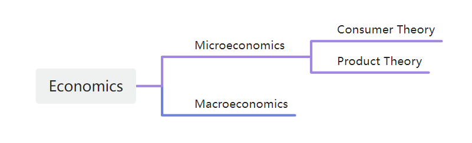
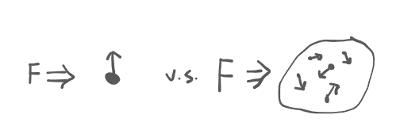

# Production

## Part I

**Big Map of Economics**

- Microeconomics
    - Analyze choices made by households and firms, as well as how they interest in markets.
    - Usually from the perspective of an individual. 
    - $\Rightarrow$ A market for specific goods or services.
- Macroeconomics
    - Analyze the overall performance fo an economy, i.e., the economy-side pheonomena.
    - Usually from the perspective  from a country.
    - $\Rightarrow$ The economy as a whole, i.e., the sum of all decision makers in all markets.

> 

- The goal of macroeconomics is to explain the economic changes that affect many households, firms, and markets **simultaneously**.

## Part II

`Production` - A process of using labor and capital to make goods and services.

`Fixed Input` v.s. `Variable Input`
> `Fixed Input`固定投入；`Variable Input`可变投入
- Land, building, install some machine
    - `Fixed Input`
    - Cost a lot in the begin;
    - You do not need more of them if you continue.
- Labor, hire some people, electricity, water, cloth, metal
    - `Variable Input`
    - For each unit you produce, you need more of them.

- `Fixed Input` are the input that does not vary with the quantity of output produced.
- `Variable Input` are the input that varies with the quantity of output produced.

**If time is long enough, all the inputs are variable.**

Time Frame
- `Short Run` - Period of time during which at least one input is fixed.
- `Long Run` - Period of time during which all inputs are variable.
> 短期：至少一个输入给定。长期：所有输入可变。 和时间长短无关。

There is more flexibility in the long-run than in the short-run to vary production.

**Measures of Production**
- `Total Product`, abbr.`TP` - The total amount of output produced.
- `Marginal Product`, abbr.`MP` - The extra output produced from one more unit of a particular input, when all other input are fixed.
- `Average Product`, abbr.`AP` - `TP` divided by the unit of a particular input used.
    - A measure of productivity, i.e. how productive is the factor of production.

> `TP`总产量；`MP`边际产量；`AP`平均产量。

`Law od Diminishing Marginal Returns` - The `MP` of a variable input will first increase and then decrease, and eventually approaches zero as more is used in the **short-run**.

> 边际产量递减法则：**短期**内，**边际产量**随着可变投入的增加，先增加后**减少**，最终趋于零。 
> 条件：有一些投入是固定的 $\Rightarrow$ 短期。

Implications: 
- The increasing rate of output approaches 0, so that there is a limit to the output that can be obtained by using more of a variable input when some inputs are fixed.
    > 加大一种投入对产量的提高是有限的。
- The `AP` of a variable input will also increase at first and then decrease.
    > 平均产量 $\nearrow \searrow$ 。

> $$\begin{aligned}
> MP &= f(x) \\
> TP &= \int_{0}^{x} f(t) dt = F(x) \\
> AP &= \frac{1}{x}F(x) \\
> 
> TP' &= MP\\
> AP' &= \frac{1}{x}(f(x)-\frac{1}{x}F(x))
> \end{aligned}$$

## Part III

Broad Definition of SHort-Run and Long-Run

| | Short-Run | Long-Run |
|---|---|---|
Consumer Theory | Decision is made at the scene.  No time to adjust for the price change. | Enough time is allowed for consumers or producers to adjust fully to price change.  People are able to develop and identify substitutes. |
Production Theory | Period of time during which at least one input is fixed. | Period of time during which all inputs are variable. |

